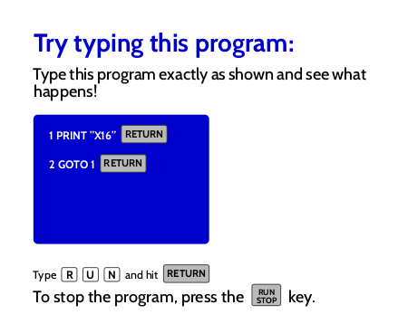
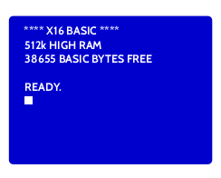
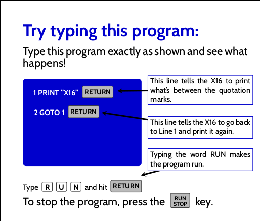
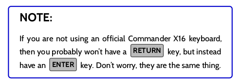
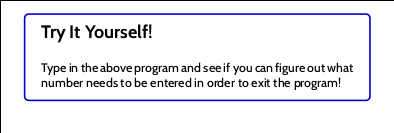

# Commander X16 User's Guide

This is an unofficial User's Guide for the Commander X16
(https://www.commanderx16.com) written by by the community.  It aims to be
considered good enough to be adopted officially by 8-Bit Industries and the
Commander X16 project team.

## Inspiration and Structure

This User's Guide takes inspiration (often shamelessly) from the Commodore
VIC-20 User's Guide.  This was chosen for multiple reasons, not least of which
is the reputation that the VIC-20 User's Guide holds in the retro computing
community for being one of the best computer manuals ever printed.  When David
Murray (the 8-Bit Guy) released his [first Building my Dream Computer
video](https://www.youtube.com/watch?v=ayh0qebfD2g), he introduced us to the
project by explaining his experience as a 6-year-old going through the
Commodore VIC-20 manual.  In his [second Building my Dream Computer
video](https://www.youtube.com/watch?v=sg-6Cjzzg8s) he explained how the VIC-20
was now a major inspiration for the Commander X16's new hardware design.
Because the concept and the hardware already draw inspiration from the VIC-20,
it only makes sense that the User's Guide follow suit.

One of the most important features of the VIC-20 User's Guide is that it
specifically targets a wide audience of both experienced computer users and
programmers, as well as people who have never even touched a computer before.
Therefore it needed to explain usage of the computer with no prior knowledge of
computers, starting with many things we take for granted nowadays.  The
Commander X16 User's Guide should likewise not make any assumptions.  After
all, the Commander X16 is intended to provide the experience David had as a
6-year-old in dawn of the home computing era.  The User's Guide must be
something that an inquisitive 6-year-old can read, even if they've never
touched a keyboard before.

Another feature of the VIC-20 User's Guide was that it allowed the reader to
skip to any chapter they may find interesting.  All that was required was that
the user read the first introductory chapter, and then they were encouraged to
explore the capabilities of the computer that captivated them the most.  The
X16 User's Guide should be structured likewise.  There is a chapter for
understanding the basics of operating the computer, and then there are chapters
for diving into the specifics.  Each of these chapters begins with a short
type-in BASIC program that gives the user a preview of what they are going to
learn, and then the rest of the chapter explains what they did in detail.  This
pattern should be followed all througout the book.

## Dependencies

This project uses `texlive`, and specifically the `xelatex` program for
compiling into a PDF.  On Debian/Ubuntu systems all dependencies can be installed with:

```
sudo apt-get install -y texlive-xetex texlive-bibtex-extra biber
```

## Building

A custom Makefile exists in the root directory, and it does not require any
build system like autotools or CMake.  Simply type:

```
make
```

## Contributing

The Commander X16 User's Guide is written in LaTeX, a document typesetting
language often used in academic settings.  It is _not_ necessary that you know
or understand LaTeX in order to contribute to this User's Guide.  The
maintainer's are more than happy to accept unformatted content and then apply
the proper LaTeX formatting later.  Simply find the file you wish to edit, make
the changes and additions you feel are necessary, and then submit a pull
request.  For example, if you wish to add a simple type-in program to the
chapter on graphics, you would locate the `graphics.tex` file in the source
code, write your example program and explanations in plaintext in your text
editor of choice, and then submit a pull request in the usual fashion.  The
maintainer(s) will then either accept and merge your PR (creating a GitHub
issue for applying formatting as they do so), or apply the formatting directly
in your branch before merging.  Of course, properly formatted contributions
will also be appreciated, but it is important to point out that it is not
required.


### Formatting

For those who wish to contribute formatted LaTeX code, there already exist
several conventions to make it easier.

#### Keys

When you need to display a key to the reader, you can use one of the predefined
key formats.  Keys can be used anywhere text is used, including type in boxes,
bubble boxes, tips, notes, and in the middle of sentances.  Before using one of
the key commands, it's best to set the color using `\keybackgroundcolor` and
`\keytextcolor`.

For regular keys on the keyboard, such as letters, it's best to use the `key` command:

```
\keybackgroundcolor{white}
\keytextcolor{black}
\key{p} \key{r} \key{i} \key{n} \key{t}\\
```

This will print a representation of the keys:


For keys that are wider than most keys, you can use the `\widekey` command.
Also note that you should try to match the color of the official keyboard
(https://www.wasdkeyboards.com/commander16-by-the-8-bit-guy.html):

```
\keybackgroundcolor{gray}
\keytextcolor{black}
\widekey{shift}
```


For keys where it's important to display both the shifted and unshifted values,
use the `\doublekey` command, making sure to include a `\\` for a line break
between the top and bottom:

```
\doublekey{"\\'}
```


#### Chapter Type Ins

The type in example at the beginning of each chapter is such a common feature
that the entire page can be produced using a predefined LaTeX command called
`\chaptertypein`.  Here is an example of how this is used in the introductory
chapter:

```
\chaptertypein{
	\keybackgroundcolor{gray}
	\keytextcolor{black}
	1 PRINT "X16" \widekey{return}\\\\
	2 GOTO 1 \widekey{return}\\
}
```

This produces an entire chapter type-in page as shown here:



Often you will want to annotate these examples with helper bubbles.  For
details see the the section on Bubbles below.

There is also a `\largechaptertypein` command for larger screens that can
display longer type-in programs.

#### Screen Boxes

Sometimes you would like to display a mock-X16 screen, but not at the beginning
of a chapter as a type-in example.  For that purpose, there is a much more
re-usable command `\screenbox`.  To use this command, specify a width, height,
and content:

```
\screenbox{2.75in}{2in}{
	**** X16 BASIC ****\\
	512k HIGH RAM\\
	38655 BASIC BYTES FREE\\\\
	READY.\\
	\cursor
}
```


#### Bubbles

When screens, type in examples, or diagrams need annotating, there are several
sizes of text bubbles that are predefined; `\bubble`, `\smallbubble`, and
`\tinybubble`.  Each one also includes a single arrow that can be pointed
anywhere on the page.  These bubbles are intended to be used inside of a
`tikzpicture` block.  For example, to annotate the chapter type in example
above:

```
\chaptertypein{
	\keybackgroundcolor{gray}
	\keytextcolor{black}
	1 PRINT "X16" \widekey{return}\\\\
	2 GOTO 1 \widekey{return}\\
}

\begin{tikzpicture}
	\hyphenpenalty=10000
	\bubble{2.5in}{2.5in}{4.8}{6.3}{
		This line tells the X16 to print what's between the quotation marks.}
	\bubble{2.5in}{1.75in}{4.0}{5.2}{
		This line tells the X16 to go back to Line 1 and print it again.}
	\bubble{2.5in}{1.1in}{6.0}{2.0}{
		Typing the word RUN makes the program run.}
\end{tikzpicture}
```
Which produces:



The first two arguments of a bubble are the bubble's (X,Y) coordinates from the
lower left of the `tikzpicture` block, given in whatever units you choose.  The
second two arguments are the (X,Y) coordinates of where the arrow is drawn to,
from the lower left corner of the `tikzpicture` block, unfortunately specified
custom `tikzpicture` unit (see `tikzpicture`'s documentation for details, but
it's easy enough to figure out).

#### Notes

Sometimes it is nice to have a note in the middle of the chapter for
clarification, but it often needs to be lengthier than a simple footnote at the
bottom of a page.  For this purpose, there is a predefined `\note` command that
creates a note box:

```
\note{

	If you are not using an official Commander X16 keyboard, then you probably
	won't have a \widekey{return} key, but instead have an \widekey{enter} key.
	Don't worry, they are the same thing.

}
```




#### Tips

Tip boxes are useful when the information is not strictly necessary, but that a
user might find helpful.  Tips are very similar to notes, except that you can
specify a title for the tip to help the user scan the page and find it later if
need be:

```
\tip{Clearing The Screen}{
	Clearing the screen will be one of the most frequent things you do
	while working on your Commander X16.  It is worth memorizing the
	\widekey{shift} \doublekey{CLR\\HOME} key combination so that you don't
	have to reference this manual every time you want to start with a fresh
	screen.\\

	You can also clear the screen by typing the {\ttfamily CLS} command and
	pressing \widekey{return}, but most people prefer to use \widekey{shift}
	\doublekey{CLR\\HOME}.

}
```


#### Try It Yourself Boxes

Sometimes you may want to encourage the reader to try something out for
themselves.  The `\tryit` command will create a box with a "Try It Yourself!"
header that you can fill with whatever you would like the reader to try:

```
\tryit{

	Type in the above program and see if you can figure out what number needs
	to be entered in order to exit the program!

}
```



#### Code Blocks

Often you will want to display code examples as either short snippets or full
type-in programs.  For both these purposes, a standard `\codeblock` command has
been defined:

```
\codeblock{
	10 PRNNT " X16";\\
	20 GOTO 10\\
}
```

This is simply a convenience method for printing text in a fixed-width font,
but it should always be used for code examples in case additional styling is
added in the future. 
